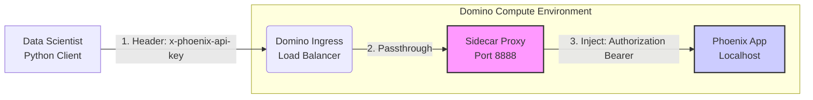

Voici la documentation complète au format **Markdown (`.md`)**. J'y ai ajouté une section **"Architecture Diagram"** avec un schéma explicatif utilisant la syntaxe `mermaid` (standard supporté par Confluence, GitHub, GitLab, etc.).

Tu peux copier/coller le bloc ci-dessous directement dans un fichier nommé `README.md` ou dans l'éditeur Confluence.

---

```markdown
# Technical Guide: Arize Phoenix Deployment on Domino Data Lab

## 1. Context & Problem Statement
We deployed **Arize Phoenix** (LLM Tracing & Evaluation) as a WebApp within Domino Data Lab. We encountered two specific infrastructure challenges:

1.  **Authentication Stripping:** The Domino Ingress Controller (Load Balancer) often strips or overwrites the standard `Authorization` header, preventing standard Bearer token authentication.
2.  **UI Asset Routing:** The Phoenix Web UI (React) failed to load static assets (JS/CSS) because it wasn't aware of the Domino relative sub-paths (`/user/project/...`), resulting in a blank page.

## 2. Solution Architecture
To resolve these issues, we implemented a **Sidecar Proxy** pattern.

### Architecture Diagram



**Workflow:**

1. **Client:** Sends traces using a custom header `x-phoenix-api-key`. This header is **not** blocked by Domino.
2. **Proxy:** Intercepts the request, reads the custom header, and converts it into a standard `Authorization: Bearer <token>` header.
3. **Phoenix:** Receives a fully authenticated request on `localhost`.
4. **UI Fix:** The startup script injects the `PHOENIX_HOST_ROOT_PATH` environment variable so the UI knows its public URL.

---

## 3. User Guide (For Data Scientists)

To send traces to this instance, you must configure your client to use the **bypass header** instead of the standard auth method.

### Client Configuration Snippet

When using `phoenix` or `langtrace`, configure your headers as follows:

```python
import os
from phoenix.trace.langchain import LangChainInstrumentor

# 1. Retrieve Configuration
# Ensure PHOENIX_COLLECTOR_ENDPOINT ends with "v1/traces"
# Example: [https://domino.url/user/project/r/notebookSession/1234/v1/traces](https://domino.url/user/project/r/notebookSession/1234/v1/traces)
collector_endpoint = os.getenv("PHOENIX_COLLECTOR_ENDPOINT") + "v1/traces"
api_key = os.getenv("PHOENIX_API_KEY")

# 2. Register with the Custom Header
# We use 'x-phoenix-api-key' to bypass the Domino Ingress filtering.
instrumentor = LangChainInstrumentor()
instrumentor.instrument(
    endpoint=collector_endpoint,
    headers={
        "x-phoenix-api-key": api_key  # <--- CRITICAL STEP
    },
    project_name="My GenAI Project"
)

print(f"✅ Tracing enabled. Sending traces to: {collector_endpoint}")

```

---

## 4. Server-Side Implementation

This section details the scripts used to run the WebApp inside Domino.

### A. `run.sh` (Startup Orchestration)

This script sets up the environment and manages the two processes (Phoenix & Proxy).

```bash
#!/usr/bin/env bash
set -euo pipefail

# --- 1. Port Configuration ---
# Port exposed by Domino to the outside world
PROXY_PORT="${PORT:-8888}"
# Internal random port for Phoenix (hidden from outside)
PHOENIX_INTERNAL_PORT="$(python3 -c 'import socket; s=socket.socket(); s.bind(("", 0)); print(s.getsockname()[1]); s.close()')"

# --- 2. UI Path Correction (Fixes Blank Screen) ---
# We construct the URL path based on Domino standard variables.
if [ -n "${DOMINO_PROJECT_OWNER:-}" ] && [ -n "${DOMINO_RUN_ID:-}" ]; then
    export PHOENIX_HOST_ROOT_PATH="/${DOMINO_PROJECT_OWNER}/${DOMINO_PROJECT_NAME}/r/notebookSession/${DOMINO_RUN_ID}"
    echo "[INFO] Domino Environment detected. Setting ROOT_PATH to: $PHOENIX_HOST_ROOT_PATH"
fi

# --- 3. Auth Configuration ---
export PHOENIX_ENABLE_AUTH=true
export PHOENIX_SECRET="${PHOENIX_SECRET:-change-me-securely}"
export PHOENIX_UPSTREAM="[http://127.0.0.1](http://127.0.0.1):${PHOENIX_INTERNAL_PORT}"

# Cleanup trap
cleanup() { jobs -p | xargs -r kill || true; }
trap cleanup EXIT

# --- 4. Start Phoenix (Background) ---
# Listens only on localhost for security
python3 -m phoenix.server.main \
    --host 127.0.0.1 \
    --port "${PHOENIX_INTERNAL_PORT}" \
    serve &

# Wait for Phoenix to warm up
sleep 5

# --- 5. Start Proxy (Foreground) ---
# Listens on 0.0.0.0 to accept traffic from Domino
uvicorn proxy:app --host 0.0.0.0 --port "${PROXY_PORT}"

```

### B. `proxy.py` (The Middleware)

A lightweight FastAPI app that handles header transformation.

```python
import os
import logging
import httpx
from fastapi import FastAPI, Request
from fastapi.responses import Response

# Config
UPSTREAM = os.getenv("PHOENIX_UPSTREAM", "[http://127.0.0.1:8899](http://127.0.0.1:8899)").rstrip("/")
ALT_HEADER = os.getenv("PHOENIX_ALT_AUTH_HEADER", "x-phoenix-api-key").lower()
logging.basicConfig(level=logging.INFO)
logger = logging.getLogger("proxy")

app = FastAPI()

def _get_api_key(req: Request) -> str | None:
    return req.headers.get(ALT_HEADER)

@app.api_route("/{path:path}", methods=["GET", "POST", "PUT", "DELETE", "OPTIONS"])
async def proxy(path: str, request: Request):
    # 1. Build Target URL
    url = f"{UPSTREAM}/{path}" if path else UPSTREAM
    
    # 2. Prepare Headers (Sanitize & Inject Auth)
    headers = dict(request.headers)
    headers.pop("host", None)
    headers["host"] = "127.0.0.1" 

    # HEADER TUNNELING: Convert custom header to Bearer Token
    api_key = _get_api_key(request)
    if api_key:
        headers["authorization"] = f"Bearer {api_key}"
        logger.debug("Injected Authorization header from x-phoenix-api-key")

    # 3. Forward Request
    async with httpx.AsyncClient(verify=False, timeout=60.0) as client:
        try:
            resp = await client.request(
                method=request.method,
                url=url,
                params=dict(request.query_params),
                headers=headers,
                content=await request.body(),
            )
        except Exception as e:
            logger.error(f"Proxy Error: {e}")
            return Response(content=f"Proxy Error: {e}", status_code=502)

    # 4. Return Response (Filter hop-by-hop headers)
    excluded = {"content-encoding", "content-length", "transfer-encoding", "connection"}
    out_headers = {k: v for k, v in resp.headers.items() if k.lower() not in excluded}

    return Response(content=resp.content, status_code=resp.status_code, headers=out_headers)

```

```

```
